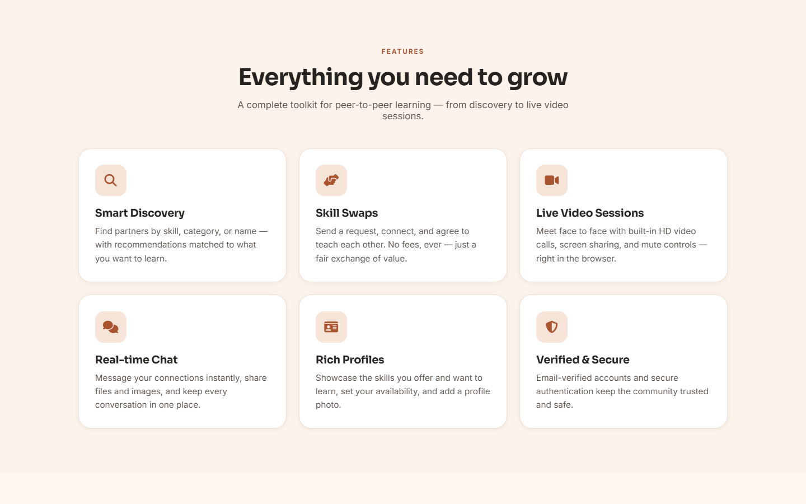
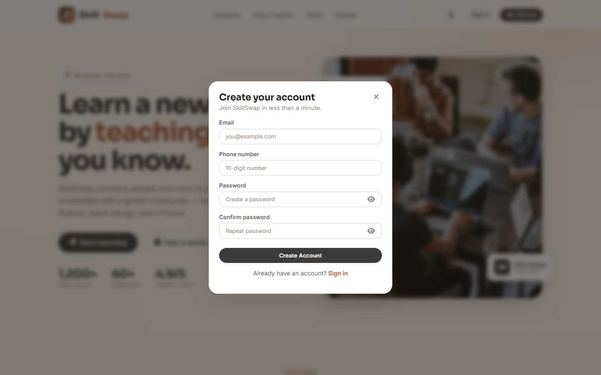
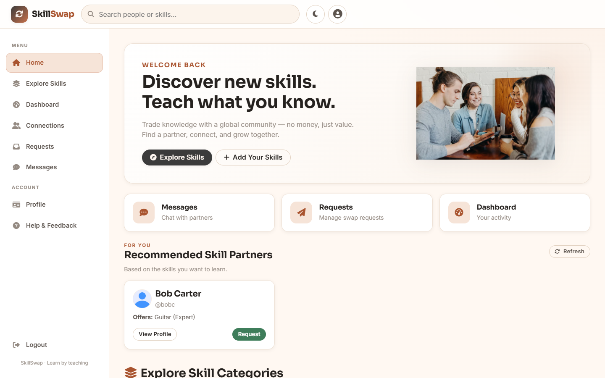
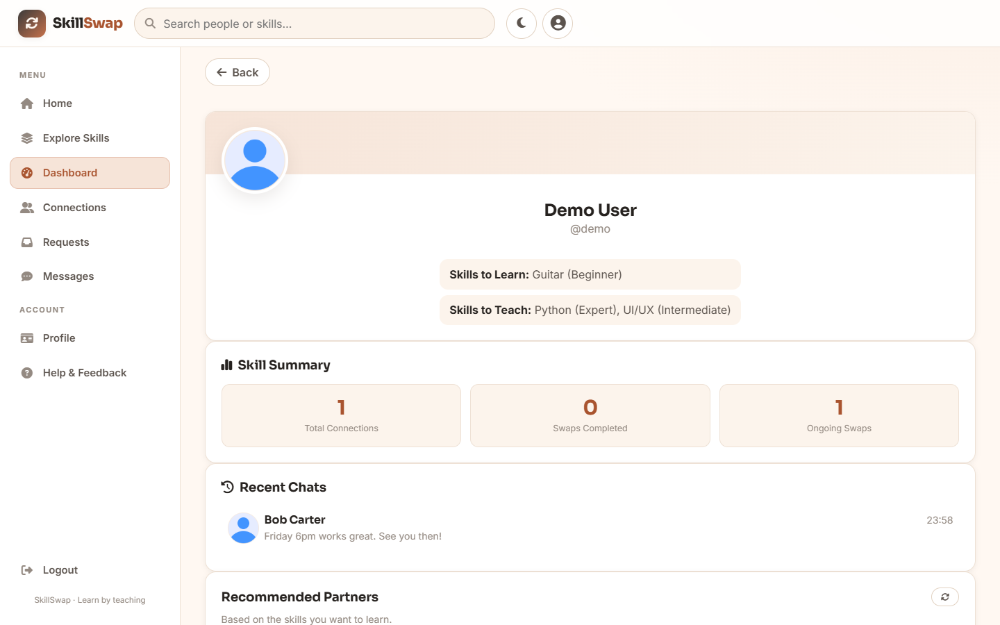
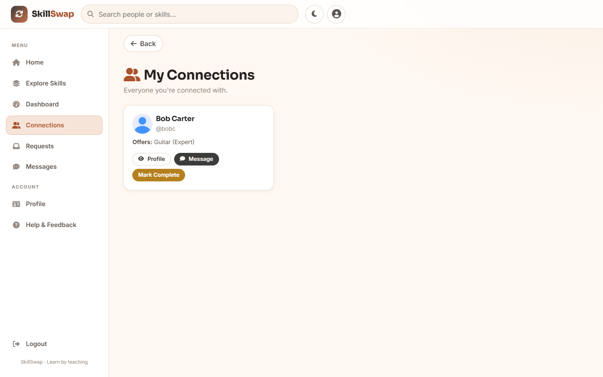
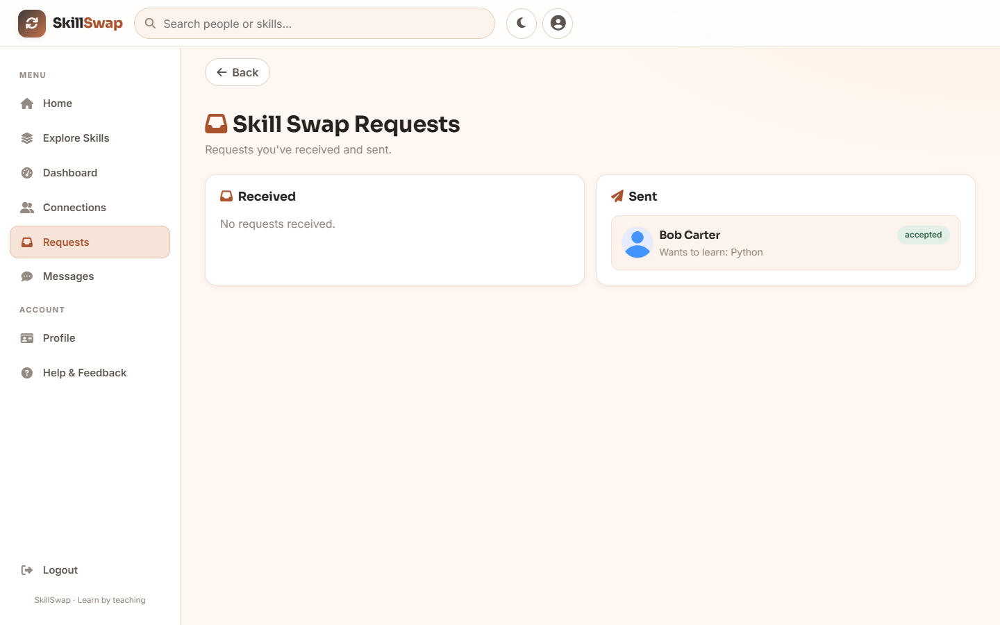
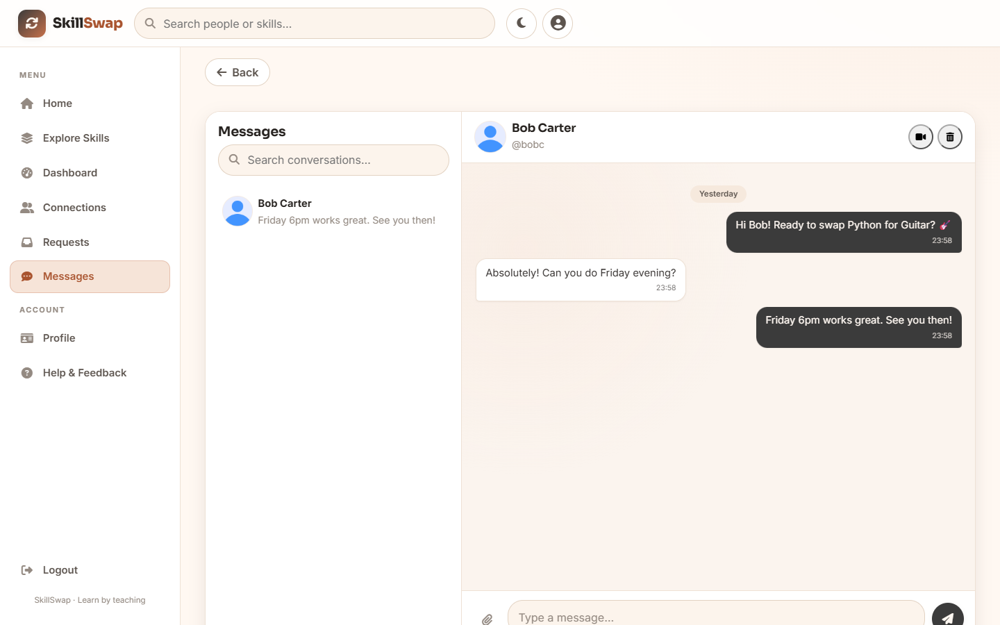
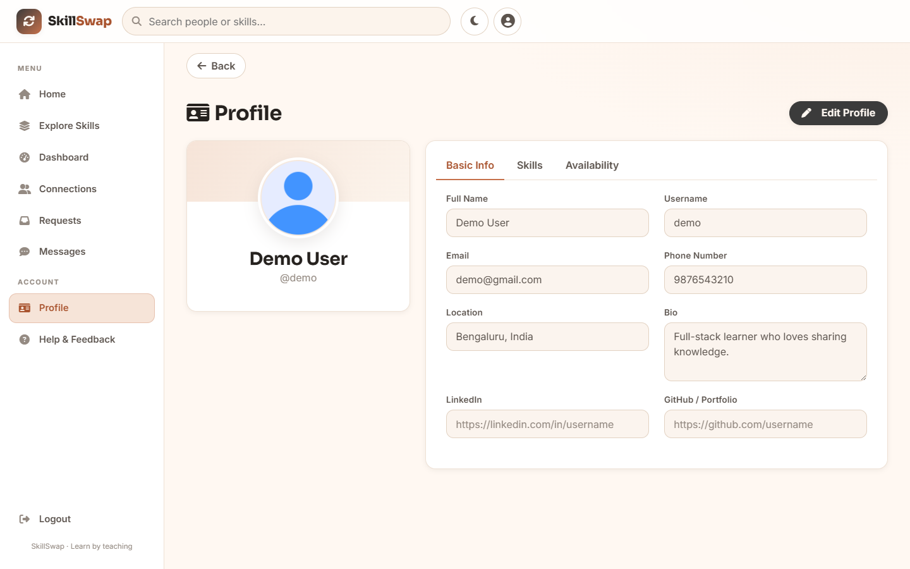
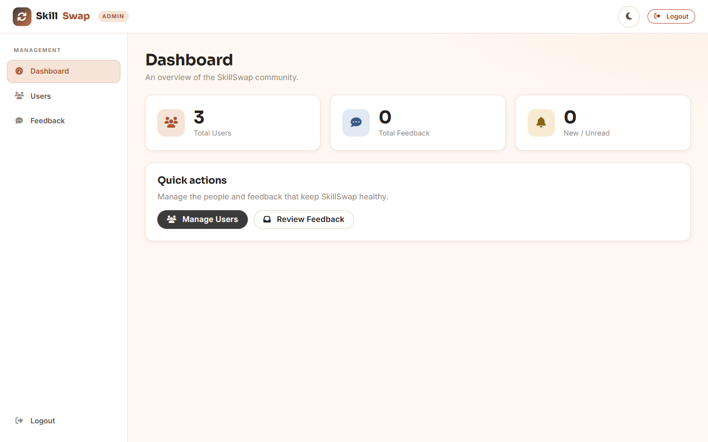
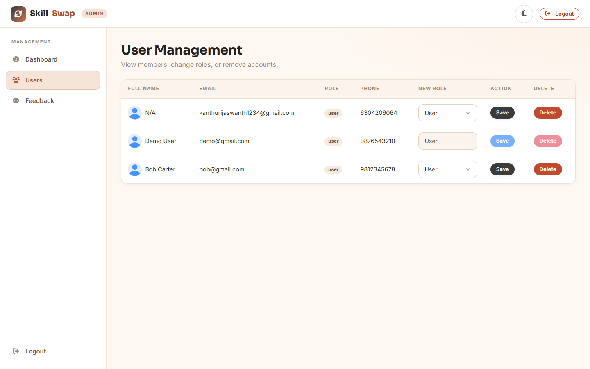

# 🔁 SkillSwap — Learn by Teaching

**SkillSwap** is a peer-to-peer skill-exchange platform where people **trade knowledge instead of money**. List the skills you can *teach* and the ones you want to *learn*, get matched with partners, connect, chat in real time, and meet over built-in video calls.

> No money. Just value.


---

## ✨ Features

- **Authentication** — email sign-up with **OTP verification**, secure JWT login, and password reset.
- **Rich profiles** — skills offered / wanted (with levels & categories), availability, social links, and an **uploadable profile picture**.
- **Discovery** — browse by category, search by name/skill, and get **recommended partners** based on what you want to learn.
- **Connections & requests** — send / accept / reject / cancel requests, and mark swaps complete.
- **Real-time chat** — instant messaging with **file & image sharing**, unread badges, and **delete-conversation**. Press **Enter** to send, **Shift+Enter** for a new line.
- **Video calling** — in-browser WebRTC calls with **screen share**, **mute/unmute mic**, and fullscreen.
- **Dashboard** — your connections, completed/ongoing swaps, recent chats, and recommendations.
- **Admin panel** — real-data dashboard to manage users (roles, deletion) and respond to feedback via email.
- **Polished UX** — one unified design system, **light & dark mode** (remembered), premium toasts & confirm dialogs, and a fully **responsive** layout (mobile → desktop).

---

## 📸 Screenshots

### Landing page & features



### Sign up


### Inside the app (after signing in)
| Home | Dashboard |
|---|---|
|  |  |

| Connections | Requests |
|---|---|
|  |  |

**Messages, chat & video call**


**Profile**


### Dark mode


### Admin dashboard
| Overview | User management |
|---|---|
|  |  |

---

## 🧱 Tech stack

| Layer | Technology |
|---|---|
| Frontend | HTML, CSS, vanilla JavaScript (Bootstrap 5, Font Awesome, Tagify) |
| Backend | Node.js, Express 5 |
| Realtime | Socket.io (chat + WebRTC signaling) |
| Database | MongoDB + Mongoose (with automatic **local fallback**) |
| Auth | JWT (`x-auth-token`), bcrypt password hashing |
| Email | Nodemailer (Gmail SMTP) |
| Uploads | Multer |

---

## 📁 Project structure

```
final/
├── backend/
│   ├── server.js              # Express app, HTTPS, Socket.io, DB connect (+ local fallback)
│   ├── .env                   # Your secrets (NOT committed) — copy from .env.example
│   ├── certs/                 # Self-signed TLS cert (server.key / server.crt)
│   ├── models/                # User, Message, Request, Feedback
│   ├── routes/                # auth, profile, requests, connections, messages, users, feedback, admin
│   │   └── uploads/           # profile pictures & chat attachments (served at /uploads)
│   ├── controllers/           # message & request logic
│   ├── middleware/            # auth (JWT) + admin guard
│   └── utils/sendEmail.js     # Nodemailer helper
└── frontend/
    ├── newindex.html          # Landing page + auth modals (served at /)
    ├── profile-1.html         # Multi-step profile setup (after sign-up)
    ├── homepage.html          # Main app (home, dashboard, connections, requests, chat, video, profile)
    ├── admin.html             # Admin dashboard
    ├── config.js              # API base URL
    ├── css/  theme.css        # 🎨 design system (tokens, light/dark, component styles)
    │         homepage.css · style-1.css · admin.css
    └── js/   ui.js            # toasts, confirm dialog, theme manager (shared)
              script.js · homepage_merged_2.js · admin.js
```

---

## ✅ Prerequisites

- **Node.js 18+** (tested on Node 24) and **npm**
- Internet is **optional** — if the cloud database can't be reached, the app starts a local one automatically.

---

## 🚀 Setup & run

**1. Install dependencies**

```bash
cd final/backend
npm install
```

**2. Configure environment**

A working `backend/.env` is already included in this repo, so you can **run it directly**. To use your own database / email instead, edit `backend/.env` (template in `backend/.env.example`). If the configured DB is unreachable, the app falls back to a local database automatically.

**3. Start the server**

```bash
npm start
```

You should see:

```
🚀 Server is running on port 5000
✅ Connected to MongoDB (primary database)
```

…or, if your cloud DB isn't reachable:

```
⚠️  Primary MongoDB unavailable: ...
✅ Connected to LOCAL MongoDB fallback
```

**4. Open the app**

Go to **https://localhost:5000/** in your browser.

> ⚠️ It uses a **self-signed HTTPS certificate** (required so the browser allows camera/mic for video calls). The first time you'll see a security warning — click **Advanced → Proceed to localhost**. This is safe for local development.

**5. Create an account**

Sign up with a **Gmail** (or `rguktong.ac.in`) address you can open → enter the 6-digit **OTP** emailed to you → complete profile setup → you're in.
*(If email can't be sent, the OTP is printed in the server console.)*

---

## ⚙️ Configuration

`.env` values (see `backend/.env.example`):

| Key | Description |
|---|---|
| `MONGODB_URI` | Your MongoDB connection string. Falls back to a local DB if unreachable. |
| `JWT_SECRET` | Long random string used to sign login tokens. |
| `EMAIL_HOST` / `EMAIL_PORT` | SMTP server (Gmail: `smtp.gmail.com` / `587`). |
| `EMAIL_USERNAME` / `EMAIL_PASSWORD` | Gmail address + a **Gmail App Password** (not your normal password). |
| `PORT` | Server port (default `5000`). |

---

## 🛡️ Making the first admin

Admin pages require a user whose `role` is `"admin"`. To promote the first one, set the field directly in your database:

- **MongoDB Atlas / Compass:** open the `users` collection, find your account, and change `role` from `"user"` to `"admin"`.
- **mongosh:** `db.users.updateOne({ email: "you@gmail.com" }, { $set: { role: "admin" } })`

Then sign in — you'll be routed to the **Admin dashboard**, where you can promote others from the UI.

---

## 🔍 How it works (good to know)

- **Single origin** — the backend serves both the API (`/api/...`), uploaded files (`/uploads/...`), and the frontend pages, all on `https://localhost:5000`.
- **Local DB fallback** — if `MONGODB_URI` can't be reached, `server.js` spins up a local MongoDB and stores data in `backend/.localdb` (persists across restarts). When your cloud DB is reachable again, it uses that instead — no code change.
- **Email fallback** — if the OTP email can't be sent, the code is logged to the server console so sign-up isn't blocked.
- **Theme** — light/dark preference is saved in the browser and applied before paint (no flash).

---

## 🧯 Troubleshooting

| Problem | Fix |
|---|---|
| **"Signup failed" / requests hang** | The database isn't connected. Check the server console — it will show either a successful connect or the local fallback. Verify internet / MongoDB Atlas IP allowlist. |
| **Browser says "Not secure"** | Expected (self-signed cert). Click **Advanced → Proceed to localhost**. |
| **No OTP email arrives** | Check the **server console** — the OTP is printed there if email sending fails. Ensure `EMAIL_*` uses a valid Gmail **App Password**. |
| **Port 5000 in use** | Stop the other process, or set a different `PORT` in `.env`. |
| **Camera/mic not working in calls** | Must be on `https://` (this app is) and you must allow the browser permission prompt. |

---

## 🔐 Security notes

- This repo is **private** and includes a working `backend/.env` so a teammate can run it directly. **Keep the repo private.** For any public or production use, remove `.env` from git, **rotate the secrets** (DB password, `JWT_SECRET`, Gmail App Password), and inject them via environment variables / GitHub Secrets instead.
- The bundled self-signed certificate is for **local development only** — use a real certificate in production.
- Only regenerable/runtime files are git-ignored (`node_modules`, `backend/.localdb`, uploaded files, logs).

---

*Built with a unified design system in the brand palette **Black Russian `#3B3B3B`** + **Seashell Peach `#FFF8F2`**.*
